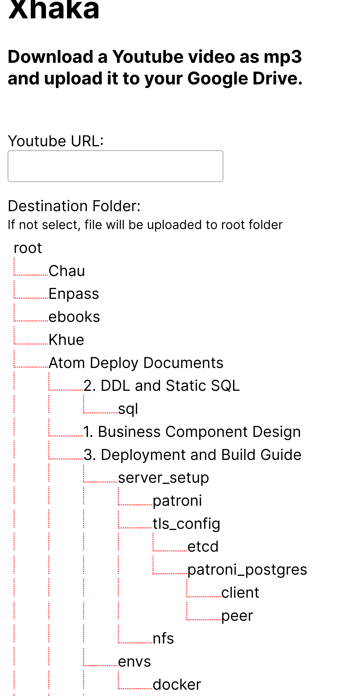

# Xhaka

Download a Youtube video as mp3 and upload it to your Google Drive.

## Why?

First: for the fun

Mainly: Because youtube app on mobile sucks! It does not have loop or background playback which is my usage for my bath time so I create this tool to download any youtube video as mp3 and save it to GG Drive then I can play it on VLC

## Run on local

- Get your [google application](https://console.developers.google.com/apis/credentials) client_id and client_secret and set them as env variables
- Install dependencies via `pip install -r requirements.txt`, you maybe want to create virtualenv and use pip-tools to manage dependencies
- Install `ffmpeg` binary on your system
- Run `FLASK_APP=xhaka/app.py FLASK_ENV=development FLASK_DEBUG=1 flask run`

## About the name Xhaka

I'm an Arsenal fan and when I've been starting this project, [this](https://www.goal.com/en/news/xhaka-storms-off-emirates-pitch-and-tells-arsenal-fans-to/xbttlq0u2sqb1wlforsbxw1ek) happened.